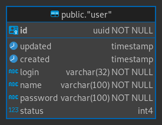
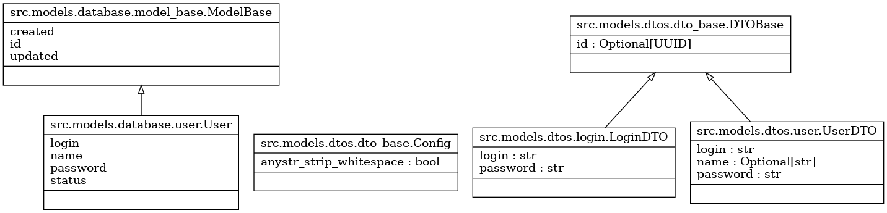
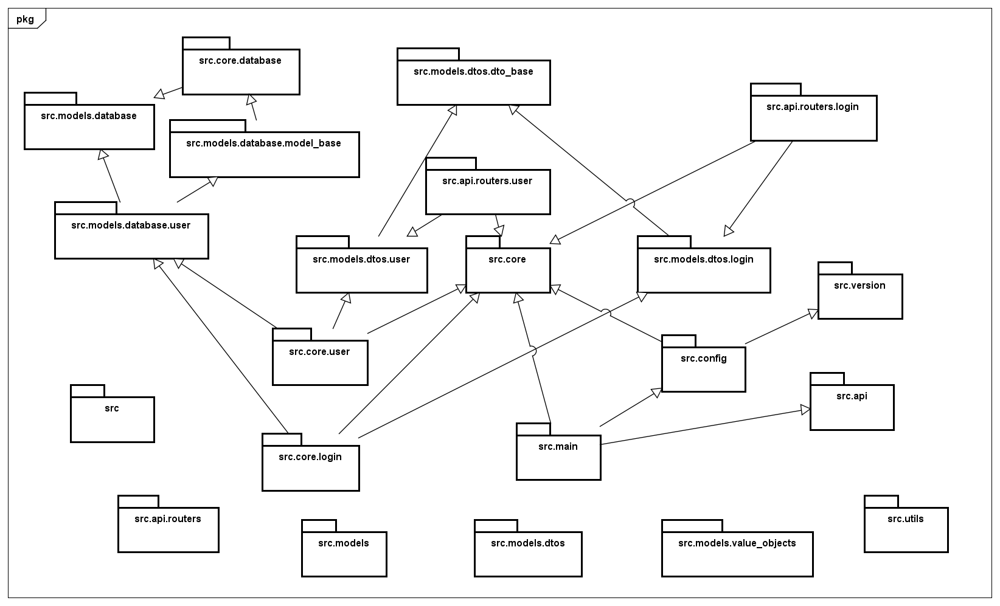
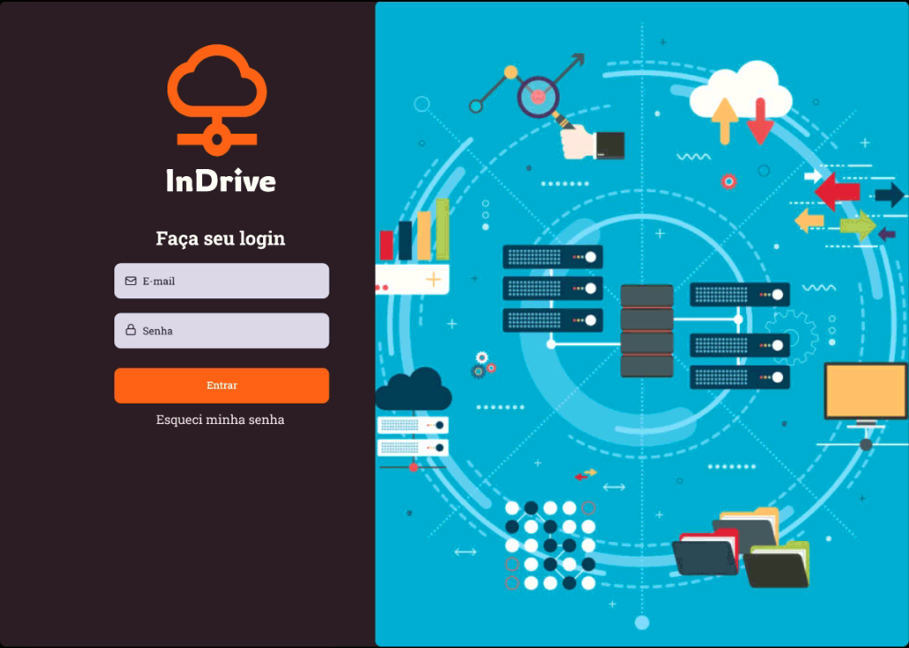
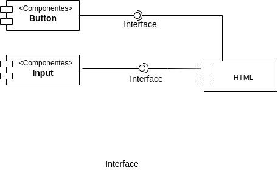
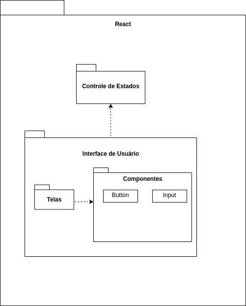

# InDrive

## Revisões

| Data | Descrição | Autor |
| --- | --- | --- |
| 08/04/2022 | Versão 1.0.0 | Luan F Barcelos |
| 10/04/2022 | Revisao Geral | Joabe Dias |
| 11/04/2022 | Add Contrato Operação | Luan F Barcelos |
| 20/04/2022 | Correçao dos componentes FE | Luan F Barcelos, Jefferson |

---

## Índice Analítico

* 1 [Casos de Uso](#1-casos-de-uso)
  * 1.1 [Login de Usuário](#11-login-de-usuário)
    * 1.1.1 [Descrição Resumida](#111-descrição-resumida)
    * 1.1.2 [Descrição Expandida Essencial](#112-descrição-expandida-essencial)
  * 1.2 [Cadastro de Usuário](#12-cadastro-de-usuário)
    * 1.2.1 [Descrição Resumida](#121-descrição-resumida)
    * 1.2.2 [Descrição Expandida Essencial](#122-descrição-expandida-essencial)
* 2 [MER](#2-mer)
* 3 [Database Schema](#3-database-schema)
* 4 [BackEnd](#4-backend)
  * 4.1 [Diagrama de Classe](#41-diagrama-de-classe)
  * 4.2 [Diagrama de Pacote](#42-diagrama-de-pacotes)
* 5 [FrontEnd](#5-frontend)
  * 5.1 [Protótipos Figma](#51-protótipos-figma)
  * 5.2 [Diagrama de Componentes](#52-diagrama-de-componentes)
  * 5.3 [Diagrama de Pacotes](#53-diagrama-de-pacotes)
* 6 [Contratos de Operação](#6-contratos-de-operação)

## 1 Casos de Uso

### 1.1 Login de Usuário

#### 1.1.1 Descrição Resumida

Este caso de uso especifica a ação de autenticação do usuário executada pelo sistema, com objetivo de se conectar à aplicação. Apenas usuários cadastrados podem se autenticar. O usuário fornece seus dados de login e senha e após a validação do sistema, torna-se apto a realizar operações na área restrita do software.

#### 1.1.2 Descrição Expandida Essencial

* Categoria: Secundário
* Atores envolvidos: Usuário comum e Usuário administrador

<br>

* Pré-condições:
  1. Usuário deve ter seu cadastro no sistema
* Pós-condições:
  1. Ao ser autenticado o usuário será redirecionado à tela inicial do sistema

<br>

* Fluxo Principal de Sucesso (cenário principal)
  1. O usuário informa o login e senha
  2. O Sistema verifica se o usuário está cadastrado
  3. O sistema verifica se a senha informada combina com o salt+hash armazenados no site
  4. O sistema devolve o token de acesso deste usuário permitindo seu acesso
* Cenários alternativos
  1. Usuário não lembra do sua senha
     * Usuário solicita ao administrador o reset da senha.
  2. Usuario nao se lembra do login
     * Usuário solicita ao administrador a busca do login correto na base
  3. Usuário não lembra do login e senha
     * Usuário solicita ao administrador a alteração do usuário e senha
  4. Usuário administrador perdeu seu acesso
     * Administrador solicita ao suporte de TI um novo acesso e a inativação do anterior

<br>

* Regras de negócio
  1. Para o acesso à aplicação o usuário precisa estar cadastrado

### 1.2 Cadastro de Usuário

#### 1.2.1 Descrição Resumida

Este caso de uso especifica a ação de cadastro de novos usuários na aplicação, com objetivo de se conectar no sistema.

#### 1.2.2 Descrição Expandida Essencial

* Categoria: Primário
* Atores envolvidos: Usuário administrador

<br>

* Pré-condições:
  1. Usuário deve ter cadastro no sistema
  2. Usuário deve logar para ter acesso
* Pós-condições:
  1. Ao ser autenticado o usuário será redirecionado à tela inicial do sistema

<br>

* Fluxo Principal de Sucesso (cenário principal)
  1. Usuário solicita o cadastro de um login administrador à equipe de T.I. do sistema
  2. Administrador técnico do sistema, via CLI, executa o script de criação de novos administradores
  3. Administrador é criado
  4. Administrador acessa o sistema
  5. Novos usuários comuns podem ser cadastrados a partir do usuario administrador
* Cenários alternativos
  1. Usuario nao se lembra do login nem da senha
     * Administrador solicita ao suporte de TI um novo acesso e a inativação do anterior
  2. Usuário deseja ter seu cadastro no sistema, mas não sabe quem é o administrador
     * Não há cadastro de usuários externo

<br>

* Regras de negócio
  1. Somente o administrador do sistema (quem o implementa), pode criar usuários administradores
  2. Somente usuários administradores podem cadastrar usuários comuns

## 2 MER



## 3 Database Schema

```sql
-- DROP SCHEMA public;

CREATE SCHEMA public AUTHORIZATION "inDrive";
-- public."user" definition

-- Drop table

-- DROP TABLE public."user";

CREATE TABLE public."user" (
    id uuid NOT NULL,
    updated timestamp NULL,
    created timestamp NULL DEFAULT now(),
    login varchar(32) NOT NULL,
    "name" varchar(100) NOT NULL,
    "password" varchar(100) NOT NULL,
    status int4 NULL DEFAULT 0,
    CONSTRAINT user_pkey PRIMARY KEY (id)
);
CREATE INDEX ix_user_id ON public."user" USING btree (id);

```

## 4 BackEnd

### 4.1 Diagrama de Classe



### 4.2 Diagrama de Pacotes



## 5 FrontEnd

### 5.1 Protótipos Figma



### 5.2 Diagrama de Componentes



### 5.3 Diagrama de Pacotes



## 6 Contratos de Operação

### 6.1 login.create(dto)

```python
dto = {
  'login':'talfulano',
  'password':'secret'
}
```

* Responsabilidades
  * Receber o par login-password contido no Objeto de Transferencia de Dados (DTO)
  * Validar a entrada do usuario no sistema
* Pré-Condições
  * Possuir cadastro
* Pós-Condições
  * Busca no banco de dados do id e o hash de senha do login informado
  * Comparar o hash da senha do banco com a recebida
  * Devolver o id do usuario caso validado
* Tratamento de exceções
  * Login ou senha incorretos
    * **Classe de erro**: fastapi.HTTPException
    * **HTTP status code**: 400
    * **Messangem**: 'Erro: Usuario ou Senha incorretos'
* Regras de negócio
  * Senha validada contra hash + salt
  * Não informar erro especifico se apenas a senha estiver incorreta para evitar tentativas de DDoS

### 6.2 usuario.create(dto)

```python
dto = {
  'login':'talfulano',
  'name':'Fulano de Tal',
  'password':'secret'
}
```

* Responsabilidades
  * Receber o objeto de transferencia de dados (DTO) do usuario
  * Validar se o login informado não existe
  * Criar o id do usuario
  * Inserir no banco os valores
* Pré-Condições
  * DTO devidamente validado pela framework (tipos e obrigatoriedade dos campos)
  * Possuir permissao de administração para executar esta função
* Pós-Condições
  * ID do usuráio foi devidamente criado
  * Usuário foi salvo no banco
  * Retorno do id do usuário
* Tratamento de exceções
  * Sem permissao de administração
    * **Classe de erro**: fastapi.HTTPException
    * **HTTP status code**: 400
    * **Messangem**: 'Erro: Usuário sem privilegios para esta operação'
  * Campo obrigatório nao informado no DTO
    * **Classe de erro**: fastapi.HTTPException
    * **HTTP status code**: 422
    * **Messangem**: 'Entidade não processada: campo {nome_do_campo} obrigatório'
  * Valor do campo diferente no DTO
    * **Classe de erro**: fastapi.HTTPException
    * **HTTP status code**: 422
    * **Messangem**: 'Entidade não processada: tipo inválido para o campo {nome_do_campo}'
* Regras de negócio
  * ID de usuário deve ser UUID versao 4
  * Antes de ser salva a senha no banco, deve ter sido realizado o calculo de seu hask + salt
  * Login deve ser unico no sistema
