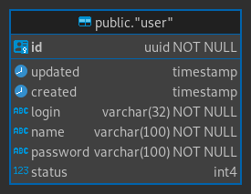
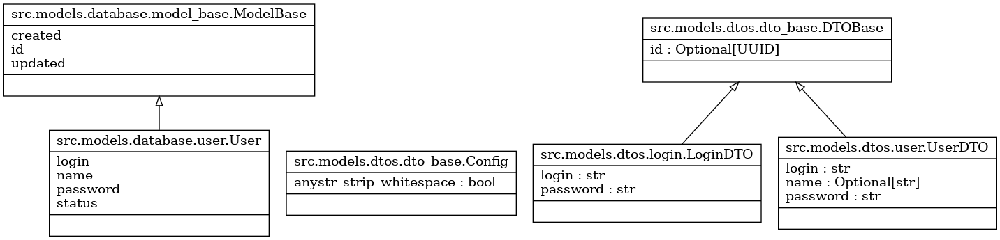
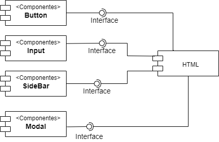
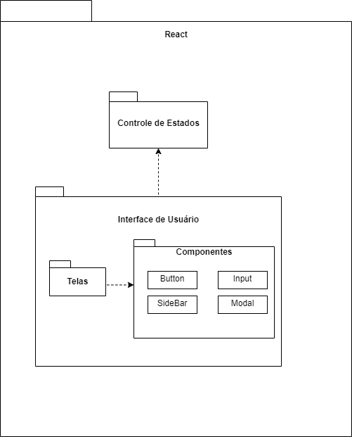

# InDrive

## Revisões

| Data | Descrição | Autor |
| --- | --- | --- |
| 08/04/2022 | Versão 1.0.0 | Luan F Barcelos|

---

## Índice Analítico

* 1 [CSU1](#1-csu1)
  * 1.1 [Descrição Resumida](#11-descrição-resumida)
  * 1.2 [Descrição Expandida Essencial](#12-descrição-expandida-essencial)
* 2 [CSU2](#2-csu2)
  * 2.1 [Descrição Resumida](#21-descrição-resumida)
  * 2.2 [Descrição Expandida Essencial](#22-descrição-expandida-essencial)

## 1 CSU1

### 1.1 Descrição Resumida

Este caso de uso especifica a ação de autenticação que um usuário executa no sistema, com objetivo de se conectar na aplicação. Apenas usuários cadastrados podem se autenticar no sistema. O usuário fornece seus dados básicos de autenticação e, após a validação no sistema, o usuário torna-se apto a realizar operações da área restrita do sistema.

### 1.2 Descrição Expandida Essencial

* Categoria: Secundário
* Atores envolvidos: Usuário comum e Usuário administrador

<br>

* Pré-condições:
  1. O usuário deve se logar para acessar o sistema
  2. O usuário deve ter acesso ao sistema
  3. O usuário deve saber seu login e senha

<br>

* Pós-condições:
  1. Ao ser autenticado, o acesso ao sistema será permitido

<br>

* Fluxo Principal de Sucesso (cenário principal)
  1. O usuário informa ao sistema o login e senha
  2. O Sistema verifica se o usuário existe
  3. O sistema verifica se a senha informada combina com o salt+hash armazenados no site
  4. O sistema devolve o token de acesso deste usuário permitindo seu uso
* Cenários alternativos
  1. O usuário não lembra do sua senha
     * O usuário solicita ao sistema administrador para resetar sua senha
  2. O usuario nao se lembra do login
     * O usuário solicita ao sistema administrador para buscar na base qual o correto
     * O usuário solicita ao administrador para criar um novo usuário
  3. O usuario nao se lembra do login nem da senha
     * O usuário solicita ao administrador para criar um novo usuário
  4. O usuário administrador perdeu seu acesso
     * O administrador solicita ao suporte ou equipe de TI para criar um novo e inativar o anterior

<br>

* Regras de negócio
  1. Para ter acesso ao sistema, o usuário precisa ser cadastrado

## 2 CSU2

### 2.1 Descrição Resumida

Este caso de uso especifica a ação de cadastrar novos usuários no sistema, com objetivo de se conectar na aplicação.

### 2.2 Descrição Expandida Essencial

* Categoria: Primário
* Atores envolvidos: Usuário administrador

<br>

* Pré-condições:
  1. O usuário deve se logar para acessar o sistema
  2. O usuário deve ter acesso ao sistema
  3. O usuário deve saber seu login e senha

<br>

* Pós-condições:
  1. Ao ser autenticado, o acesso ao sistema será permitido

<br>

* Fluxo Principal de Sucesso (cenário principal)
  1. Um usuario solicita a criação de um usuario administrador ao administrador técnico do sistema
  2. O administrador tecnico do sistema, via CLI, executa o script de criação de novos administradores
  3. O usuario administrador é criado
  4. Novos usuarios comuns podem ser criados a partir do usuario administrador
* Cenários alternativos
  1. O usuario nao se lembra do login nem da senha
     * O usuário solicita ao administrador para criar um novo usuário
  2. O Usuário deseja se cadastrar no sistema
     * O usuário solicita ao administrador para criar um novo usuário
  3. O usuário não se lembra do login e senha ou desejar se cadastrar no sistema, mas não sabe quem é o administrador
     * Não há cadastro de usuários externos

<br>

* Regras de negócio
  1. Somente usuários administradores podem cadastrar usuários comuns
  2. Somente o administrador do sistema (quem o implementa), pode criar usuários administradores


### 3 MER



### 4 Database Schema

```sql
-- DROP SCHEMA public;

CREATE SCHEMA public AUTHORIZATION "inDrive";
-- public."user" definition

-- Drop table

-- DROP TABLE public."user";

CREATE TABLE public."user" (
    id uuid NOT NULL,
    updated timestamp NULL,
    created timestamp NULL DEFAULT now(),
    login varchar(32) NOT NULL,
    "name" varchar(100) NOT NULL,
    "password" varchar(100) NOT NULL,
    status int4 NULL DEFAULT 0,
    CONSTRAINT user_pkey PRIMARY KEY (id)
);
CREATE INDEX ix_user_id ON public."user" USING btree (id);

```

### 5 Diagrama de Classe



### 6 Diagrama de Componentes (frontend)



### 7 Diagrama de Pacotes (backend)


