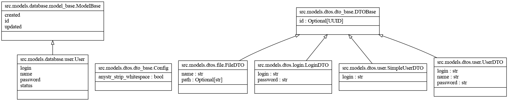

# InDrive

## Revisões

| Data | Descrição | Autor |
| --- | --- | --- |
| 28/04/2022 | Versão 1.0.0 | Luan F Barcelos, Jefferson |

---

## Índice Analítico

* 1 [Casos de Uso](#1-casos-de-uso)
  * 1.1 [Envio de Arquivos](#11-envio-de-arquivos)
    * 1.1.1 [Descrição Resumida](#111-descrição-resumida)
    * 1.1.2 [Descrição Expandida Essencial](#112-descrição-expandida-essencial)
  * 1.2 [Recebimento de Arquivos](#12-recebimento-de-arquivos)
    * 1.2.1 [Descrição Resumida](#121-descrição-resumida)
    * 1.2.2 [Descrição Expandida Essencial](#122-descrição-expandida-essencial)
* 2 [BackEnd](#2-backend)
  * 2.1 [Diagrama de Classe](#21-diagrama-de-classe)
  * 2.2 [Diagrama de Pacote](#22-diagrama-de-pacotes)
* 3 [FrontEnd](#3-frontend)
  * 3.1 [Protótipos Figma](#31-protótipos-figma)
  * 3.2 [Diagrama de Componentes](#32-diagrama-de-componentes)
  * 3.3 [Diagrama de Pacotes](#33-diagrama-de-pacotes)
* 4 [Contratos de Operação](#4-contratos-de-operação)

## 1 Casos de Uso

### 1.1 Envio de Arquivos

#### 1.1.1 Descrição Resumida

Este caso de uso especifica o envio de arquivos para seu disco virtual com o objetivo de enviá-los a qualquer momento com acesso a internet ou intranet.

#### 1.1.2 Descrição Expandida Essencial

* Categoria: SecundPrimárioário
* Atores envolvidos: Todos os usuarios

<br>

* Pré-condições:
  1. Usuário deve estar logado
* Pós-condições:
  1. O arquivo enviado deve estar disponível em sua lista de arquivos

<br>

* Fluxo Principal de Sucesso (cenário principal)
  1. O usuário solicita o envio de um arquivo
  2. O sistema processa o arquivo enviado
  3. O arquivo se torna disponível em seu perfil
  4. O arquivo passa a ser visível na sua listagem de arquivos
* Cenários alternativos
  1. Usuário interrompe o envio
     * O arquivo parcial é removido do sistema
  2. Usuario perde a conexao com o sistema sem finalizar o envio
     * O arquivo parcial é removido do sistema
  3. O sistema falha ao processar o arquivo
     * O arquivo parcial é removido do sistema
     * É informado ao usuario que houve um problema

<br>

* Regras de negócio
  1. Usuários poderão enviar arquivos somente em suas contas pessoais
  2. Os arquivos somente serão visíveis aos usuarios que os enviou, ou a quem for dada permissã

### 1.2 Recebimento de Arquivos

#### 1.2.1 Descrição Resumida

Este caso de uso especifica o acesso aos arquivos enviados com o objetivo de obtê-los a qualquer momento com acesso a internet ou intranet.

#### 1.2.2 Descrição Expandida Essencial

* Categoria: Primário
* Atores envolvidos: Todos os usuarios

<br>

* Pré-condições:
  1. Usuário deve estar logado
  2. Usuário deve possuiír arquivos enviados
* Pós-condições:
  1. Os arquivos recebidos permanecem no sistema e no computador de quem solicitou

<br>

* Fluxo Principal de Sucesso (cenário principal)
  1. O usuário solicita o recebimento de um arquivo
  2. O sistema processa o arquivo solicitado
  3. O arquivo é rebido pelo usuario
* Cenários alternativos
  1. O sistema perde conexao com o usuario
     * O recebimento é interrompido
  2. O arquivo nao consegue ser processado
     * O envio e interrompido
     * É informado uma mensagem de erro ao usuário

<br>

* Regras de negócio
  1. O usuário poderá solicitar o recebimento de arquivos somente dos quais possuir acesso

## 2 BackEnd

### 2.1 Diagrama de Classe



### 2.2 Diagrama de Pacotes


## 3 FrontEnd

### 3.1 Protótipos Figma


### 3.2 Diagrama de Componentes


### 3.3 Diagrama de Pacotes


## 4 Contratos de Operação

### 4.1 file.create(dto, request)

* Request via multpart-formdata

```python
dto = {
  'file': file,
  'file': file,
  'file': file,
  ...
  'file': file,
}

request.header['user] = 'user_login
```

* Responsabilidades
  * Receber o arquivo (file) contido no Objeto de Transferencia de Dados (DTO)
  * Salvar o arquivo na home do usuario
* Pré-Condições
  * Possuir cadastro
* Pós-Condições
  * Arquivo salvo
* Tratamento de exceções
  * Usuario nao logado
    * **Classe de erro**: fastapi.HTTPException
    * **HTTP status code**: 400
    * **Messangem**: 'Usuario não informado'
  * Nenhum arquivo selecionado para envio
    * **Classe de erro**: fastapi.HTTPException
    * **HTTP status code**: 400
    * **Messangem**: 'There was an error parsing the body'
* Regras de negócio
  * Usuário somente salva arquivos em sua home
  * É possivel enviar um ou mais arquivos simultaneamente

### 4.2 file.get_all(dto)

```python
dto = {
  'login':'talfulano'
}
```

* Responsabilidades
  * Listar todos os arquivos de determinado usuario
* Pré-Condições
  * Usuário possuir cadastro
* Tratamento de exceções
  * DTO não informado
    * **Classe de erro**: fastapi.HTTPException
    * **HTTP status code**: 422
    * **Messangem**: 'Entidade não processada: tipo inválido para o campo {nome_do_campo}'
* Regras de negócio
  * Todos os arquivos do usuario são listaveis
