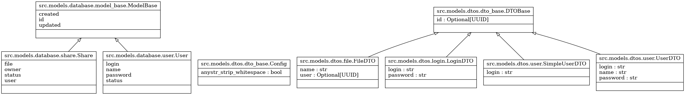
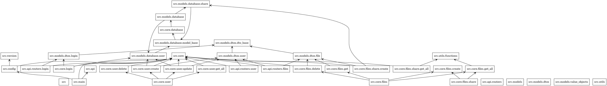
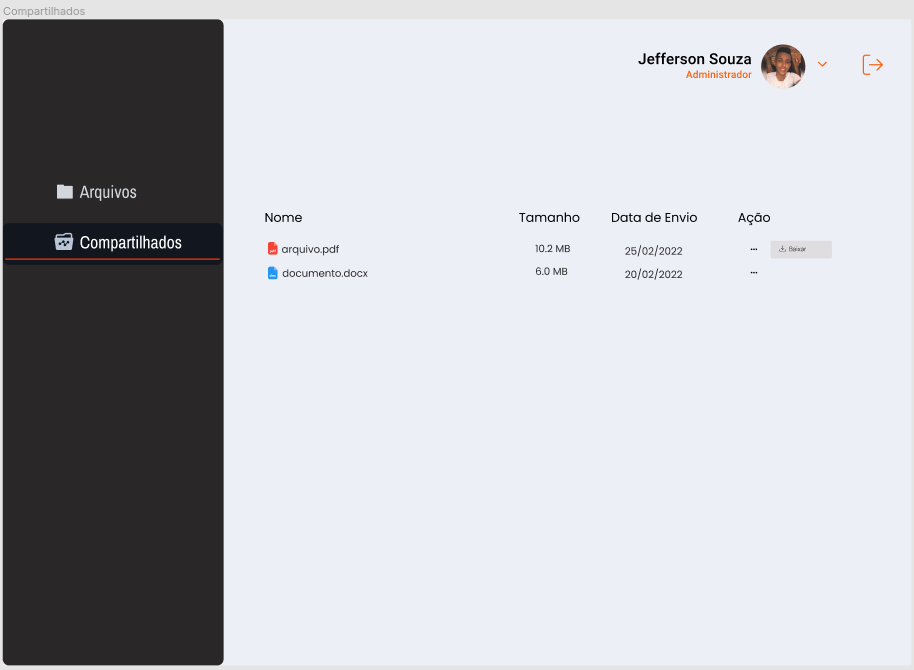
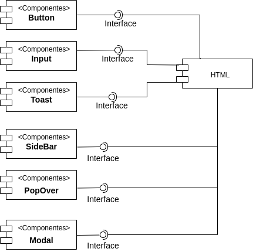
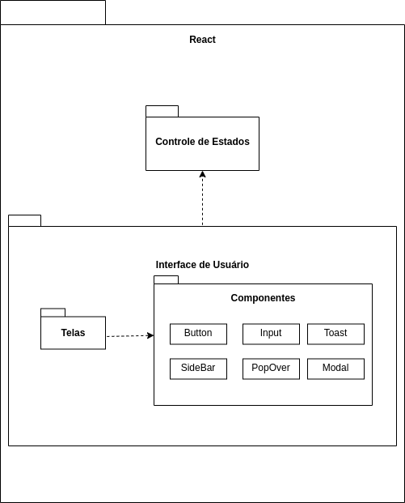

# InDrive

## Revisões

| Data | Descrição | Autor |
| --- | --- | --- |
| 03/05/2022 | Versão 1.0.0 | Luan F Barcelos, Jefferson |

---

## Índice Analítico

* 1 [Casos de Uso](#1-casos-de-uso)
  * 1.1 [Compartilhamento de arquivos entre usuários](#11-compartilhamento-de-arquivos-entre-usuários)
    * 1.1.1 [Descrição Resumida](#111-descrição-resumida)
    * 1.1.2 [Descrição Expandida Essencial](#112-descrição-expandida-essencial)
  * 1.2 [Recebimento de Arquivos](#12-recebimento-de-arquivos)
    * 1.2.1 [Descrição Resumida](#121-descrição-resumida)
    * 1.2.2 [Descrição Expandida Essencial](#122-descrição-expandida-essencial)
* 2 [BackEnd](#2-backend)
  * 2.1 [Diagrama de Classe](#21-diagrama-de-classe)
  * 2.2 [Diagrama de Pacote](#22-diagrama-de-pacotes)
* 3 [FrontEnd](#3-frontend)
  * 3.1 [Protótipos Figma](#31-protótipos-figma)
  * 3.2 [Diagrama de Componentes](#32-diagrama-de-componentes)
  * 3.3 [Diagrama de Pacotes](#33-diagrama-de-pacotes)
* 4 [Contratos de Operação](#4-contratos-de-operação)
  * 4.1 [4.1 file.share(dto, request)](#41-filesharedto-request)
  * 4.2 [4.2 file.delete(dto)](#42-filedeletedto)
  * 4.3 [4.3 file.download(name, request)](#43-filedownloadname-request)

## 1 Casos de Uso

### 1.1 Compartilhamento de arquivos entre usuários

#### 1.1.1 Descrição Resumida

Este caso de uso especifica a ação de compartilhar pastas ou arquivos com outros usuários que também tenham acesso à aplicação.

#### 1.1.2 Descrição Expandida Essencial

* Categoria: Primário
* Atores envolvidos: Todos os usuarios

<br>

* Pré-condições:
  1. Usuário deve estar logado
  2. Existir outro usuário
* Pós-condições:
  1. O arquivo enviado deve estar disponível em sua lista de arquivos

<br>

* Fluxo Principal de Sucesso (cenário principal)
  1. O usuário seleciona um arquivo para compartilhar
  2. O sistema mostra todos os usuários para compartilhar
  3. O usuário informa o usuário para compartilhar
  4. O arquivo passa a ser visível na sua listagem de arquivos
* Cenários alternativos
  1. Usuário dono deleta o arquivo compartilhado
     * O arquivo deixa de estar compartilhado
  2. Usuario reenvia o mesmo arquivo
     * O arquivo necessita de ser recompartilhado

<br>

* Regras de negócio
  1. Usuários poderão compartilhar qualquer arquivo com qualquer outro usuário
  2. Se um arquivo compartilhado for deletado, o compartilhamento deve ser invalidado

## 2 BackEnd

### 2.1 Diagrama de Classe



### 2.2 Diagrama de Pacotes



## 3 FrontEnd

### 3.1 Protótipos Figma



### 3.2 Diagrama de Componentes



### 3.3 Diagrama de Pacotes



## 4 Contratos de Operação

### 4.1 file.share(dto, request)

```python
dto = {
  'name': 'file.ext',
  'user': 'UUID4'
}

request.header['X-User'] = 'UUID4'
```

* Responsabilidades
  * Receber a requisição de compartilhamento de arquivo contido no Objeto de Transferencia de Dados (DTO)
  * Salvar o registro de compartilhamento do arquivo no banco de dados onde:
    * `dto.user` é quem recebe
    * `dto.name` é o arquivo recebido
    * request.header['X-User'] é o proprietario do arquivo
* Pré-Condições
  * Possuir cadastro (proprietario e recebedor)
  * O arquivo existir
* Pós-Condições
  * Arquivo se torna disponível a ambos usuaários
* Tratamento de exceções
  * Usuario nao logado
    * **Classe de erro**: fastapi.HTTPException
    * **HTTP status code**: 400
    * **Messangem**: 'Usuario não informado'
  * `X-User` não presente nos headers
    * **Classe de erro**: fastapi.HTTPException
    * **HTTP status code**: 400
    * **Messangem**: 'Usuario não informado'
* Regras de negócio
  * Se `X-User` ou `dto.user` nao existir, bloqueia a requisição

### 4.2 file.delete(dto)

```python
dto = {
  'name':'file.ext'
}
```

* Responsabilidades
  * Deletar um arquivo
  * Remover compartilhamento do arquivo deletado caso exista
* Pré-Condições
  * Usuário possuir cadastro
  * Arquivo existir
* Tratamento de exceções
  * DTO não informado
    * **Classe de erro**: fastapi.HTTPException
    * **HTTP status code**: 422
    * **Messangem**: 'Entidade não processada: tipo inválido para o campo {nome_do_campo}'
  * Arquivo não existe
    * **Classe de erro**: fastapi.HTTPException
    * **HTTP status code**: 400
    * **Messangem**: 'Arquivo não existe'
* Regras de negócio
  * Deletar o arquivo na home do usuario
  * Remover o compartilhamento caso exista

### 4.3 file.download(name, request)

```python
name:'file.ext'
request: {
  headers: {
    'X-Owner':'UUID4',
    'X-User':'UUID4'
  }
}
```

* Responsabilidades
  * Realizar o download de algum arquivo
* Pré-Condições
  * Usuário possuir cadastro
  * Arquivo existir
  * Usuário possuir direito de download do arquivo
* Tratamento de exceções
  * Arquivo não informado ou não existe
    * **Classe de erro**: fastapi.HTTPException
    * **HTTP status code**: 400
    * **Messangem**: 'Sem permissão de download ou arquivo solicitado não existe'
  * `X-Owner` não informado
    * **Classe de erro**: fastapi.HTTPException
    * **HTTP status code**: 400
    * **Messangem**: 'Proprietario do arquivo não informado'
  * `X-Owner` não existe
    * **Classe de erro**: fastapi.HTTPException
    * **HTTP status code**: 400
    * **Messangem**: 'Arquivo não existe'
  * `X-User` sem permissão para download do arquivo (compartilhamento)
    * **Classe de erro**: fastapi.HTTPException
    * **HTTP status code**: 400
    * **Messangem**: 'Sem permissão de download ou arquivo solicitado não existe'
* Regras de negócio
  * Verificar a permissão de download (compartilhamento)
  * Retornar o arquivo compartilhado
