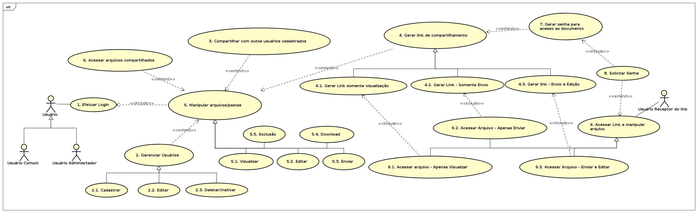

# InDrive

## Revisões

| Data | Descrição | Autor |
| --- | --- | --- |
| 25/03/2022 | Versão 1.0.0 | Luan F Barcelos   Joabe D. Milhomens   Jefferson S. de Oliveira |

---

## Índice Analítico

* 1 [Introdução](#1-introdução)
  * 1.1 [Objetivos](#11-objetivos)
  * 1.2 [Público Alvo](#12-público-alvo)
* 2 [Descrição do problema e do sistema](#2-descrição-doproblema-e-do-sistema)
  * 2.1 [Identificação e missão do Sistema](#21-identificação-e-missão-do-sistema)
  * 2.2 [Domínio do problema e contexto de sua aplicação](#22-domínio-do-problema-e-contexto-de-sua-aplicação)
  * 2.3 [Objetivos e Características Esperadas do Sistema](#23-objetivos-e-características-esperadas-do-sistema)
  * 2.4 [Diagnóstico da Situação Atual](#24-diagnóstico-da-situação-atual)
* 3 [Casos de Uso e Requisitos Funcionais](#3-casos-de-uso-e-requisitos-funcionais)
  * 3.1 [Diagramas de Caso de Uso e Lista de casos de uso](#31-diagramas-de-caso-de-uso-e-lista-de-casos-de-uso)
  * 3.2 [Descrição de Casos de Uso](#32-descrição-de-casos-de-uso)
* 4 [Requisitos e restrições não funcionais](#4-requisitos-e-restrições-não-funcionais)
  * 4.1 [Requisitos de Informação](#41-requisitos-de-informação)
  * 4.2 [Requisitos de Interface Homem-Computador (RHIC)](#42-requisitos-de-interface-homem-computador-rhic)
  * 4.3 [Requisitos de Interface Externa (RIEX)](#43-requisitos-de-interface-externa-riex)
  * 4.4 [Requisitos de Plataforma de Hardware (RPHW)](#44-requisitos-de-plataforma-de-hardware-rphw)
  * 4.5 [Requisitos de Plataforma de Software (RPSW)](#45-requisitos-de-plataforma-de-software-rpsw)
  * 4.6 [Requisitos de Desempenho (RDES)](#49-requisitos-de-desempenho-rdes)
  * 4.7 [Requisitos de disponibilidade (RDIS)](#47-equisitos-de-disponibilidade-rdis)
  * 4.8 [Requisitos de Segurança de Acesso (RSEG)](#48-requisitos-de-segurança-de-acesso-rseg)
  * 4.9 [Requisitos de Manutenibilidade (RMAN)](#49-requisitos-de-manutenibilidade-rman)
  * 4.10 [Requisitos de Portabilidade (RPOR)](#410-requisitos-de-portabilidade-rpor)
  * 4.11 [Requisitos de Documentação (RDOC)](#411-requisitos-de-documentação-rdoc)
* 5 [Bibliografia](#5-bibliografia)

## 1 Introdução

Toda empresa tem a necessidade de receber e enviar arquivos, seja a seus funcionários, fornecedores ou clientes. A segurança dos sistemas de provisionamento de envio público de arquivos nem sempre possui uma boa confiabilidade, podendo expor documentos sensíveis para toda a internet. Desta forma, surgiram serviços como Dropbox, Google Drive, One Drive, entre outros, que tem a finalidade de serem uma nuvem de compartilhamento privada. Porém estes não possuem um mecanismo de envio para usuários não autenticados, que chamaremos por &quot;convidado&quot; (o usuário convidado enviar um arquivo para a empresa).

Desta forma, foi desenvolvido um sistema denominado OwnCloud, que tem como finalidade justamente isto, e ao longo do tempo ganhou mais funcionalidades, como provisionamento de calendário, planejamento de tarefas em modo kanban, provisionamento de servidor de e-mail, o deixando bastante pesado.

Além disto, o próprio Own Cloud foi migrado para uma licença de código fechado, dificultando a própria empresa a implantar o seu servidor de arquivos, abrindo precedente para um fork (uma ramificação sendo cuidada por outras pessoas) do projeto inicial mantendo o modelo open source, chamado Next Cloud.

Ainda assim, o projeto já era bastante robusto, e não era compatível com hardwares mais simples, muitas vezes usados por pequenos usuários ou empresas. Com base nisso, foi pensado em um projeto clone da funcionalidade de envio e recebimento de arquivos para usuários autenticados via login-senha ou somente senha de acesso único, do Next Cloud, visando um sistema mais simples e que pudesse ser rodado em uma arquitetura e linguagem mais simples, no caso um raspberry pi 3B e linguagem Python 3.

Desta forma, faz-se necessário documentar os objetivos e requisitos gerais que este sistema necessita, de modo a ter uma baseline de desenvolvimento, bem como uma referência para futuras manutenções.

### 1.1 Objetivos

* Definir os interessados no sistema e as suas necessidades que devem ser satisfeitas pelo sistema a ser desenvolvido;
* Derivar os casos de uso e requisitos do sistema de forma a orientar a equipe de que será responsável pelo seu desenvolvimento;
* Estabelecer um contrato para negociação e concordância entre todos os interessados;
* Reduzir retrabalho com projeto, codificação e teste através da especificação geral dos requisitos;
* Prover uma base para a evolução futura do sistema a partir de uma versão aprovada (linha de base) deste documento.

### 1.2 Público Alvo

Documento destinado aos desenvolvedores e testadores, atuais e futuros. O sistema terá seu código fonte disponibilizado publicamente para uso sob licença Open Source ainda não definida, portanto qualquer gerente de empresa ou pessoa física que queira implementar o sistema, para empresa ou uso doméstico, terá um documento de instruções de como o fazer.

## 2 Descrição do problema e do sistema

### 2.1 Identificação e missão do Sistema

O sistema tem como finalidade o provisionamento de uma interface amigável e simples para o armazenamento e compartilhamento de arquivos, de diversos tamanhos e formatos, via web, usuários cadastrados ou com um acesso especial via link + chave de segurança.

### 2.2 Domínio do problema e contexto de sua aplicação

Os sistemas auto-hospedados atuais de compartilhamento de arquivos (como por exemplo o nextcloud ou owncloud) possuem uma alta complexidade com diversas funcionalidades extras que acabam identificando o projeto. Outros sistemas com esta finalidade, mas que não são auto-hospedados (como por exemplo o wetransfer ou mega) acabam por deixar os links de compartilhamento publicamente para qualquer pessoa ou bot na internet o capturar, gerando uma demanda de um sistema que a própria empresa, ou pessoa, possa hospedar, e que também possa gerir perfis de compartilhamento específicos e com segurança.

### 2.3 Objetivos e Características Esperadas do Sistema

| **Interessado(s)** | **Descrição** |
| --- | --- |
| Administradores de empresa | Com o intuito de compartilhar documentos com seus funcionários, fornecedores e/ou credores, sejam eles cadastrados ou não, de forma segura, um administrador de empresa pode fazer uso do software seja utilizando uma solução auto-hospedada gratuitamente, ou contratando alguém que hospedou o sistema. |
| Gerente de TI | Provisionar o compartilhamento de arquivos com a equipe, ou fornecer um novo serviço da empresa, tendo em vista que o sistema será open source |
| Usuário doméstico | Criar um ambiente seguro para o armazenamento de arquivos pessoais localmente, que esteja disponível publicamente na web ou na sua rede interna. |

Tabela 1 - Interessados no Sistema

### 2.4 Diagnóstico da Situação Atual

No mercado hoje existe um sistema denominado OwnCloud, que tem o mesmo escopo base do projeto descrito neste documento. Porém, ao longo do tempo ele ganhou mais funcionalidades, como provisionamento de calendário, planejamento de tarefas em modo kanban, provisionamento de servidor de e-mail, o deixando bastante pesado. Além disto, o sistema foi migrado para uma licença de código fechado, dificultando a própria empresa a implantar o seu servidor de arquivos, abrindo precedente para um fork (uma ramificação sendo cuidada por outras pessoas) do projeto inicial mantendo o modelo open source, chamado Next Cloud.

Ainda assim, o projeto já era bastante robusto, e não era compatível com hardwares mais simples, muitas vezes usados por pequenos usuários ou empresas. Com base nisso, o sistema deste projeto foi pensado em ser um simples provisionador de arquivos, com envio e recebimento entre usuários e pessoas autorizadas, sem as demais funções extras, e tendo a garantia de sempre se manter OpenSource, visando, também, ser um sistema mais simples e leve e sendo capaz de ser provisionado, inclusive em um raspberry pi 3B, para usuários domésticos interessados.

## 3 Casos de Uso e Requisitos Funcionais

### 3.1 Diagramas de Caso de Uso e Lista de casos de uso

**Imagem 01:** Casos de Uso

### 3.2 Descrição de Casos de Uso

#### CSU1 - Login de usuário

Atores: Usuário
 Categoria: Primário

Descrição:

Este caso de uso especifica a ação de autenticação que um usuário executa no sistema, com objetivo de se conectar na aplicação. Apenas usuários cadastrados podem se autenticar no sistema. O usuário fornece seus dados básicos de autenticação e, após a validação no sistema, o usuário torna-se apto a realizar operações da área restrita do sistema.

Requisitos Funcionais:

| **Ref.** | **Descrição** | **Categoria** | **Prioridade** |
| --- | --- | --- | --- |
| RFUN1 | O sistema deve prover uma interface para o login para usuários se autenticarem no sistema | Evidente | Alta |

Tabela 2 - Requisitos Funcionais do Caso de Uso CSU1-Login de usuário

#### CSU2 - Cadastro de usuário comum

Atores: Usuário
 Categoria: Primário

Descrição:

Este caso de uso especifica a ação de cadastrar novos usuários no sistema, com objetivo de se conectar na aplicação.

Requisitos Funcionais:

| **Ref.** | **Descrição** | **Categoria** | **Prioridade** |
| --- | --- | --- | --- |
| RFUN2 | O sistema deve prover uma interface para o administrador adicionar os usuários | Evidente | Alta |

Tabela 3 - Requisitos Funcionais do Caso de Uso CSU2-Cadastro de usuário comum

#### CSU3 - Envio de arquivos

Atores: Usuário
 Categoria: Primário

Descrição:

Este caso de uso especifica o envio de arquivos para seu disco virtual com o objetivo de enviá-los a qualquer momento com acesso a internet ou intranet.

Requisitos Funcionais:

| **Ref.** | **Descrição** | **Categoria** | **Prioridade** |
| --- | --- | --- | --- |
| RFUN3 | O sistema deve permitir o autor o envio de arquivos para seu disco virtual | Evidente | Alta |
| RFUN4 | O sistema deve permitir apenas o autor a exclusão do arquivo ou pasta do seu disco virtual | Evidente | Alta |
| RFUN5 | O sistema deve permitir o autor o compartilhamento de arquivos ou pastas com outros usuários | Evidente | Alta |

Tabela 4 - Requisitos Funcionais do Caso de Uso CSU3-Envio de arquivos

#### CSU4 - Acesso aos arquivos enviados

Atores: Usuário
 Categoria: Primário

Descrição:

Este caso de uso especifica o acesso aos arquivos enviados com o objetivo de obtê-los a qualquer momento com acesso a internet ou intranet.

Requisitos Funcionais:

| **Ref.** | **Descrição** | **Categoria** | **Prioridade** |
| --- | --- | --- | --- |
| RFUN6 | O sistema deve permitir o autor atualizar os arquivos ou pasta | Evidente | Alta |
| RFUN7 | O sistema deve permitir o autor o compartilhamento de arquivos ou pastas com outros usuários | Evidente | Alta |

Tabela 5 - Requisitos Funcionais do Caso de Uso CSU4 - Acesso aos arquivos enviados

#### CSU5 - Compartilhamento dos arquivos entre usuários

Atores: Usuário
 Categoria: Primário

Descrição:

Este caso de uso especifica a ação de compartilhar pastas ou arquivos com outros usuários que também tenham acesso à aplicação.

Requisitos Funcionais:

| **Ref.** | **Descrição** | **Categoria** | **Prioridade** |
| --- | --- | --- | --- |
| RFUN8 | Permitir o compartilhamento de arquivos/pastas para um grupo de usuários, que será criado no momento do compartilhamento. | Evidente | Alta |
| RFUN9 | A aplicação deve permitir 3 tipos diferentes de compartilhamento: O compartilhamento que permite apenas visualizar, compartilhamento que permite apenas o envio de informações, e o compartilhamento que permite envio e edição. | Evidente | Média |

Tabela 6 - Requisitos Funcionais do Caso de Uso CSU5 - Compartilhamento dos arquivos entre usuários

#### CSU6 - Compartilhamento dos arquivos entre não usuários

Atores: Usuário
 Categoria: Primário

Descrição:

Este caso de uso especifica a ação de compartilhar pastas ou arquivos com outros usuários que não tenham acesso ao sistema, por meio de link gerado pelo autor.

Requisitos Funcionais:

| **Ref.** | **Descrição** | **Categoria** | **Prioridade** |
| --- | --- | --- | --- |
| RFUN10 | A aplicação deve permitir gerar um link de compartilhamento para usuários não cadastrados no sistema. | Evidente | Alta |
| RFUN9 | A aplicação deve permitir gerar 3 tipos diferentes de links: O link que permite apenas visualizar, link que permite apenas o envio de informações, e o link que permite envio e edição. | Evidente | Alta |
| RFUN11 | A aplicação deve permitir gerar o link com uma senha definida no momento do compartilhamento. | Evidente | Alta |
| RFUN12 | A senha deverá ter um prazo de validade, também definido no momento da geração do link. | Evidente | Média |

Tabela 7 - Requisitos Funcionais do Caso de Uso CSU6 - Compartilhamento dos arquivos entre não usuários

#### CSU7 - Autenticação de dois fatores

Atores: Usuário
 Categoria: Primário

Descrição:

Este caso de uso especifica a ação de autenticação pelo Google Authenticator que um usuário executa no sistema, com objetivo de gerar uma maior segurança dos dados ao se conectar na aplicação.

Requisitos Funcionais:

| **Ref.** | **Descrição** | **Categoria** | **Prioridade** |
| --- | --- | --- | --- |
| RFUN13 | O sistema deve permitir ativar/desativar a autenticação de dois fatores nas configurações da aplicação. | Evidente | Alta |
| RFUN14 | O sistema deve prover uma interface para a validação de dois fatores, após informar login e senha. | Evidente | Alta |

Tabela 8 - Requisitos Funcionais do Caso de Uso CSU7 - Autenticação de dois fatores

## 4 Requisitos e restrições não funcionais

### 4.1 Requisitos de Informação

| **Ref.** | **Tipo** | **Descrição** | **Casos de Uso** |
| --- | --- | --- | --- |
| RINF1 | Básico | Manipulação de arquivos | CSU3, CSU4, CSU5, CSU6 |
| RINF2 | Básico | Gestão de permissões de compartilhamento de arquivos | CUS5, CUS6 |

Tabela 9 - Requisitos de Informação

### 4.2 Requisitos de Interface Homem-Computador (RHIC)

| **Ref.** | **Descrição** | **Casos de Uso** |
| --- | --- | --- |
| RIHC1 | Deve ser utilizado &quot;Figma&quot; para a criação da interface. | Todos |
| RIHC2 | A fonte utilizada para títulos no projeto será &quot;Roboto Slab Bold&quot;. | Todos |
| RIHC3 | A fonte utilizada para subtítulos no projeto será &quot;Poppins Regular&quot;. | Todos |
| RIHC4 | Cada formato de arquivo deve conter uma imagem específica representando aquele arquivo. | Todos |
| RIHC5 | O sistema deve conter dois temas &quot;Light&quot; e &quot;Dark&quot; | Todos |
| RIHC6 | Na tela de login deve existir um campo com usuário e senha. Além disso, deve ter um botão &quot;entrar&quot; para acessar o sistema. | CSU1 |
| RIHC7 | Na tela de autenticação dois fatores deve existir um campo com código. Além disso, deve ter um botão &quot;entrar&quot; para validar o código dois fatores no sistema. | CSU7 |
| RIHC8 | Na tela de cadastro deve existir os seguintes campos com nome , usuário e senha. Além disso, deve ter um botão &quot;cadastrar&quot; para registrar o usuário no sistema. | CSU2 |
| RIHC9 | Na tela de upload deve existir um menu para clicar e escolher o arquivo ou soltar o arquivo na página para realizar o envio. | CSU3 |
| RIHC10 | Na tela de arquivos deve existir uma tabela com todos os arquivos e pastas do usuário no diretório virtual. | CSU4 |
| RIHC11 | Na tela de arquivos o administrador do disco virtual deve ter um menu para poder renomear os arquivos ou pastas. | CSU4 |
| RIHC12 | Na tela de arquivos o administrador do disco virtual deve ter um menu para poder excluir os arquivos ou pastas. | CSU4 |
| RIHC13 | Na tela de arquivos o administrador e o convidado deve poder baixar um ou vários arquivos ou várias pastas. | CSU4 |
| RIHC14 | Na tela de arquivos o administrador do disco virtual deve ter um menu para poder mover um arquivo ou pasta | CSU4 |
| RIHC15 | Na tela de arquivos o administrador do disco virtual deve ter um menu para poder compartilhar um arquivo ou pasta. | CSU5,CSU6 |

Tabela 10 - Requisitos e Restrições de Interface Homem-Computador

### 4.3 Requisitos de Interface Externa (RIEX)

Não há interação com interface Externa neste sistema.

### 4.4 Requisitos de Plataforma de Hardware (RPHW)

| **Ref.** | **Descrição** | **Casos de Uso** |
| --- | --- | --- |
| RPHW1 | O software será desenvolvido em python, podendo ser rodado em qualquer sistema operacional que tenha interpretador desta linguagem. | Todos |
| RPHW2 | Capacidade de rodar tanto em arquiteturas AMD x86\_64, quanto em arquiteturas ARMhf com SO Linux, como Raspberry Pi 3b. | Todos |

Tabela 11 - Requisitos e Restrições de Plataforma de Hardware

### 4.5 Requisitos de Plataforma de Software (RPSW)

| **Ref.** | **Descrição** | **Casos de Uso** |
| --- | --- | --- |
| RPSW1 | O software backend deverá ser desenvolvido sem python, e frontend em react, com banco de dados Postgres13 | Todos |
| RPSW2 | O software deverá ser executado em ambiente primariamente Linux, com foco em Debian 11. | Todos |

Tabela 12 - Requisitos e Restrições de Plataforma de Software

### 4.6 Requisitos de Desempenho (RDES)

| **Ref.** | **Descrição** | **Casos de Uso** |
| --- | --- | --- |
| RDES1 | O ambiente onde o software rodará deverá permitir pelo menos três usuários acessando o banco de dados sem queda de performance. | Todos |
| RDES2 | O sistema deve ser capaz de suportar arquivos de todos os formatos. | CSU3, CSU4 |
| RDES3 | O sistema deve ser capaz de suportar arquivos de todos os tamanhos. | CSU3, CSU4 |

Tabela 13 - Requisitos e Restrições de Desempenho

### 4.7 Requisitos de disponibilidade (RDIS)

O sistema é auto-hospedado pelo usuário, o mesmo deverá utilizar sua própria política de disponibilidade.

### 4.8 Requisitos de Segurança de Acesso (RSEG)

| **Ref.** | **Descrição** | **Casos de Uso** |
| --- | --- | --- |
| RSEG1 | O software deverá solicitar uma senha e login único. | CSU1, CSU7 |
| RSEG2 | O sistema terá um usuário root com senha predefinida de fábrica, que ao realizar o primeiro acesso, irá solicitar alteração da mesma. | CSU2 |
| RSEG3 | O sistema deverá possuir HTTPS na ponta do servidor | Todos |
| RSEG4 | O sistema deverá criptografar a senha com salt + hash | Todos |
| RSEG5 | O sistema terá divisão de usuários comuns e administradores | Todos |
| RSEG6 | Usuários comuns não poderão alterar a senha de outro usuário, exceto o seu | Todos |
| RSEG7 | Somente usuários administradores poderão cadastrar novos usuários | CSU2 |
| RSEG8 | O sistema deverá validar a permissão de compartilhamento de pastas/arquivos entre usuários cadastrados OU solicitar uma senha de uso único para download/upload | CSU5, CSU6 |
| RSEG9 | Todas as APIs, com exceção da login, deverão ser acessíveis somente via autenticação JWT | Todos |

Tabela 14 - Requisitos e Restrições de Segurança

### 4.9 Requisitos de Manutenibilidade (RMAN)

| **Ref.** | **Descrição** | **Casos de Uso** |
| --- | --- | --- |
| RMAN1 | Todo programa deve estar documentado de acordo com as orientações contidas na Norma de Documentação de Programas da empresa. | Todos |
| RMAN2 | O sistema deverá ser dividido em módulo backend (python) e frontend (nodejs) | Todos |
| RMAN3 | O sistema backend deverá ser escrito de forma a ser capaz de portar as apis independentes para qualquer outro projeto que utilize python, independente da framework utilizada. | Todos |
| RMAN4 | O sistema deverá ser disponibilizado sob a licença GPL 3.0, seguindo todas as suas diretrizes e restrições. | Todos |

Tabela 15 - Requisitos e Restrições de Manutenibilidade

### 4.10 Requisitos de Portabilidade (RPOR)

| **Ref.** | **Descrição** | **Casos de Uso** |
| --- | --- | --- |
| RPOR1 | O software deverá ser capaz de rodar em qualquer sistema operacional que tenha suporte de interpretação de python e javascript. | Todos |

Tabela 16 - Requisitos e Restrições do Portabilidade

### 4.11 Requisitos de Documentação (RDOC)

| **Ref.** | **Descrição** | **Casos de Uso** |
| --- | --- | --- |
| RDOC1 | Toda a documentação do software será disponibilizada em um repositório exclusivo (denominado docs) dentro da organização no github | Todos |
| RDOC2 | Toda a documentação específica de uso geral e tutorial de provisionamento deverá estar disponível nos repositórios exclusivos de cada modulo do sistema no formato README.md | Todos |

Tabela 17 - Requisitos e Restrições de Documentação

## 5 Bibliografia

Ronaldo Lopes de Oliveira, **EOR - Modelo de Documento de Especificação de Objetivos e Requisitos de Software**, Versão 3, fevereiro de 2022.
